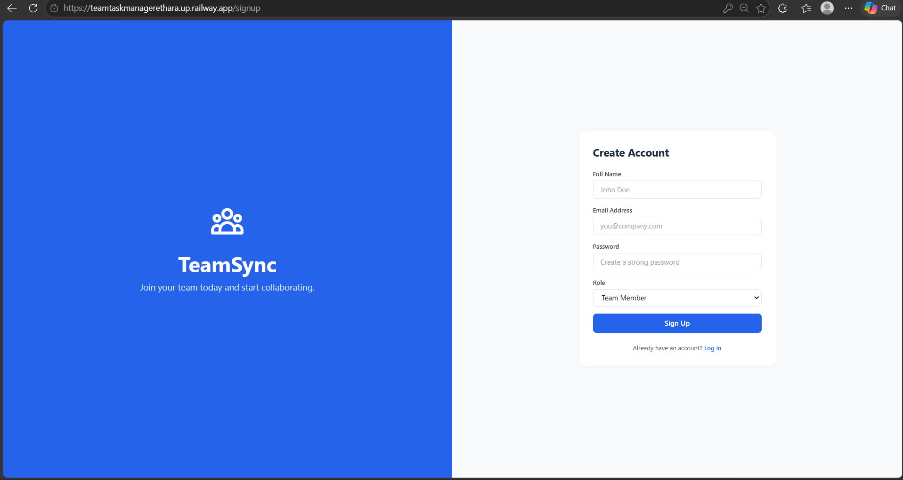
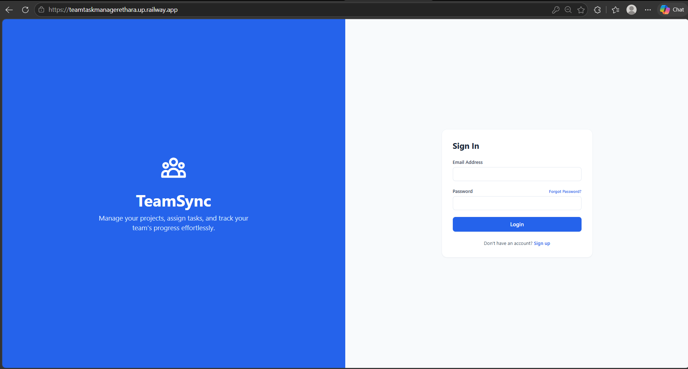
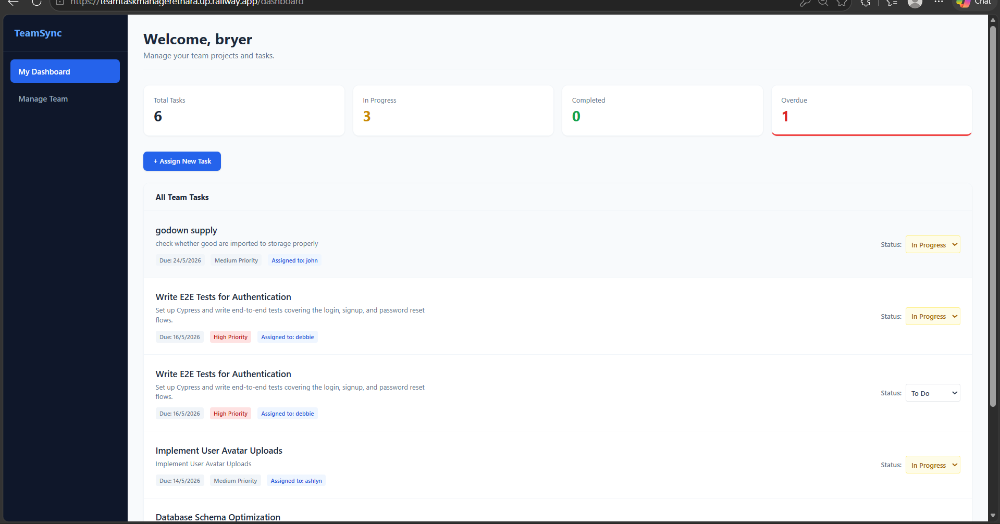
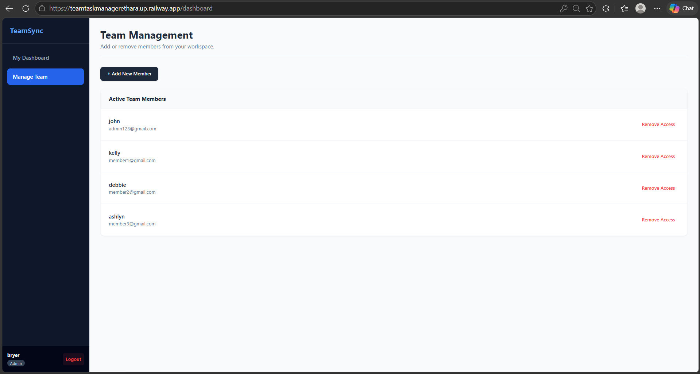
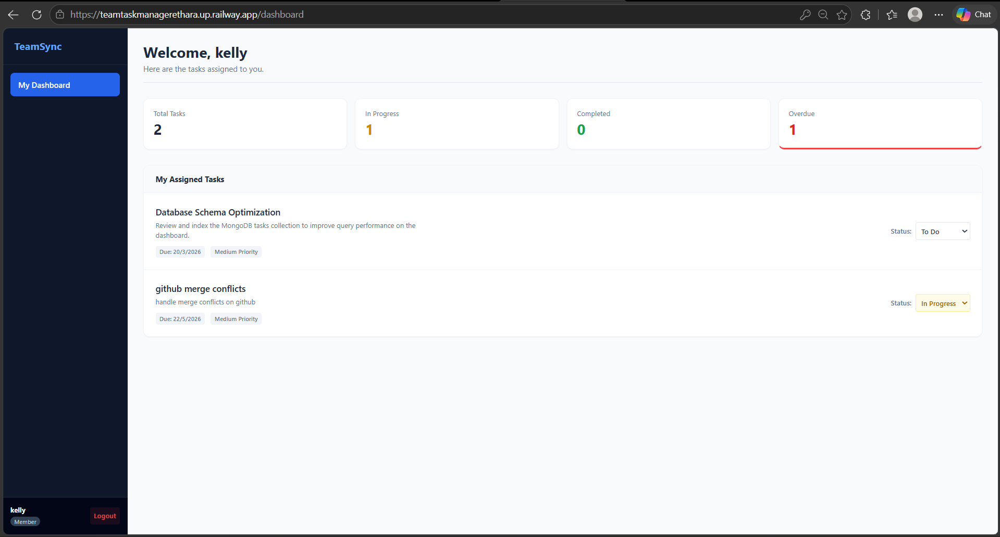

# TeamSync - Team Task Manager 🚀

TeamSync is a full-stack collaborative task management web application built with the MERN stack. It allows teams to create projects, assign tasks, track progress, and manage members through a role-based access control system (Admin vs. Member).


---

## 📸 Screenshots of Working Application


### Login & Authentication



### Admin Dashboard & Task Management


### Member View


---

## ✨ Key Features
* **Role-Based Access Control (RBAC):** Distinct dashboards and permissions for Admins and Members.
* **Task Management:** Admins can create tasks with Due Dates, Priorities (Low, Medium, High), and assign them to specific members.
* **Progress Tracking:** Members can update their assigned task statuses (To Do, In Progress, Done).
* **Team Management:** Admins can seamlessly add or revoke access for team members.
* **Secure Authentication:** JWT-based secure login, signup, and direct password reset functionality.
* **Responsive Dashboard:** Real-time statistics tracking total, completed, in-progress, and overdue tasks.

---

## 🛠️ Tech Stack
* **Frontend:** React.js (Vite), Tailwind CSS, React Router DOM, Axios
* **Backend:** Node.js, Express.js, JSON Web Tokens (JWT), Bcrypt.js
* **Database:** MongoDB (Mongoose ODM)
* **Deployment:** Railway

---

## 📁 Directory Structure
This project uses a monorepo structure, housing both the client and server in a single repository.

```text
team-task-manager/
├── backend/                # Node.js & Express API
│   ├── middleware/         # JWT Auth & Role validation
│   ├── models/             # Mongoose Schemas (User, Task)
│   ├── routes/             # API Endpoints (auth, tasks, users)
│   ├── package.json
│   └── server.js           # Backend Entry Point
├── frontend/               # React & Vite Application
│   ├── src/
│   │   ├── context/        # Global Auth Context
│   │   ├── pages/          # Login, Signup, Dashboard UI
│   │   ├── App.jsx         # App Routing
│   │   └── main.jsx
│   ├── package.json
│   ├── tailwind.config.js
│   └── vite.config.js
├── .gitignore
└── README.md
```
---

## 💻 Local Setup Instructions

### 🔧 Prerequisites
- Node.js installed
- MongoDB Community Server running locally
- Git

---

### 1️⃣ Clone the Repository

```bash
git clone https://github.com/your-username/teamtaskmanager.git
cd teamtaskmanager
````

---

### 2️⃣ Backend Setup

```bash
cd backend
npm install
```

Create a `.env` file inside `backend/`:

```env
PORT=5000
MONGO_URI=your_mongodb_url
JWT_SECRET=your_super_secret_jwt_key
```

Start backend server:

```bash
npm run dev
```

---

### 3️⃣ Frontend Setup

```bash
cd frontend
npm install
```

Create a `.env` file inside `frontend/`:

```env
VITE_API_URL=http://localhost:5000
```

Start frontend:

```bash
npm run dev
```

👉 App runs at: **[http://localhost:5173](http://localhost:5173)**

---

## 🚀 Deployment (Railway)

### 🗄️ Step 1: Provision Database

* Create a new Railway project
* Select **Provision MongoDB**
* Copy the generated `MONGO_URL`

---

### ⚙️ Step 2: Deploy Backend

* Click **New → GitHub Repo**
* Select your repo
* Go to **Settings → Root Directory** → `/backend`

Add environment variables:

```env
MONGO_URI=<MongoDB URL>
JWT_SECRET=<secure random string>
```

* Go to **Networking → Generate Domain**
* Copy backend URL (no trailing `/`)

---

### 🌐 Step 3: Deploy Frontend

* Add another GitHub service
* Set **Root Directory** → `/frontend`

Add:

```env
VITE_API_URL=<backend_url>
```

* Generate domain

---

🎉 **Application is now live and fully connected!**

---

